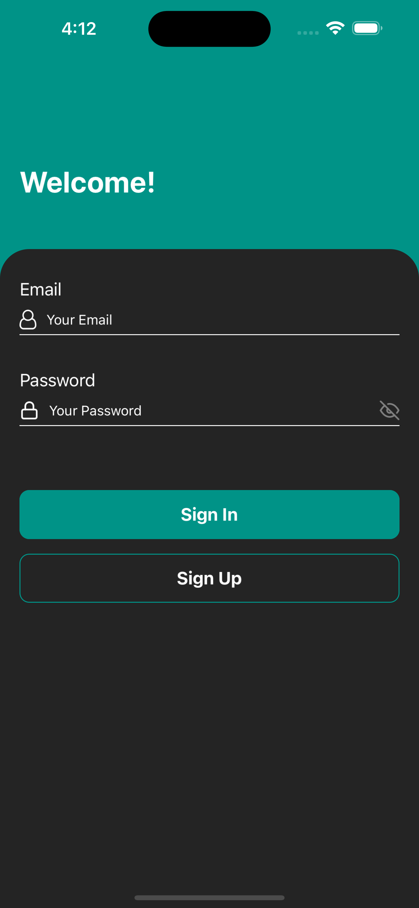
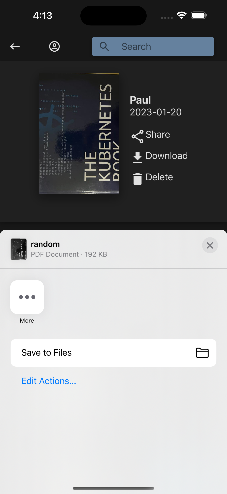
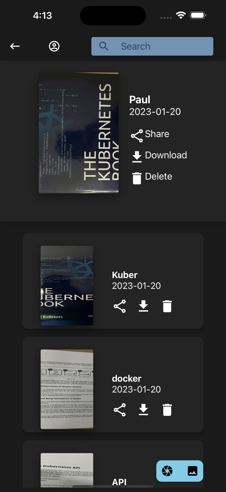
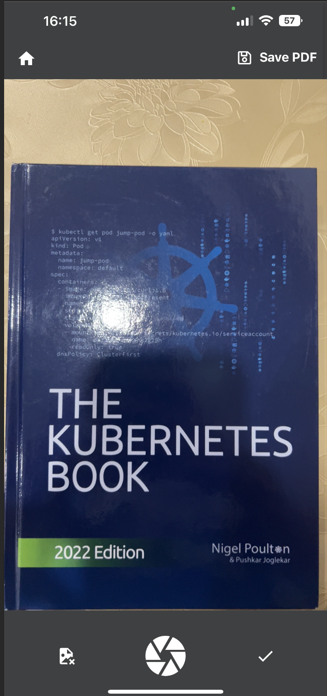

# Scan-To-Pdf
----------

## About
----------
- This app is supposed to make your life easier in taking photos from your phone and convert them to pdfs.
- Some representative pictures of the application:
  - ]
  - ]
  - ]
  - ]
## How to run
-----------

- Not having a proper release either on Android/iOS means that you must dowbload the repository and build the project yourself.
- Requirements:
  - Python 3.10
  - Django Rest Framework installed
  - DjangoRest ImageB64 library
  - Django
  - Pillow
  - run npm install (while in easypdf/frontend)
  - also from easy/db/utils run bashGetNgrok or getNgrok (bash for Unix based systems and getNgrok for Windows.)
